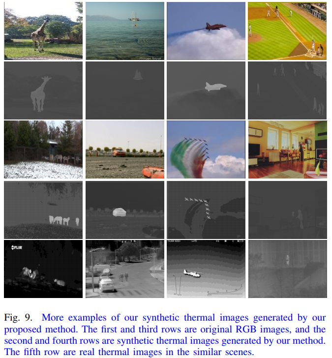
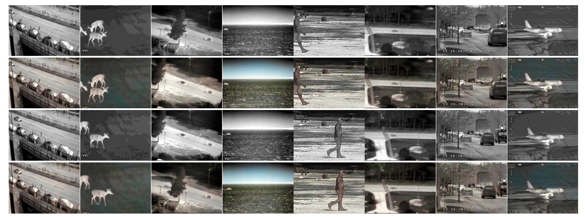

# Introduction
SiamCDA: Complementarity-and distractor-aware RGB-T tracking based on Siamese network

Recent years have witnessed the prevalence of using the Siamese network for RGB-T tracking because of its remarkable success in RGB object tracking. Despite their faster than real-time speeds, existing RGB-T Siamese trackers suffer from low accuracy and poor robustness, compared to other state-of-the-art RGB-T trackers. To address such issues, a new complementarity- and distractor-aware RGB-T tracker based on Siamese network (referred to as SiamCDA) is developed in this paper. To this end, several modules are presented, where the feature pyramid network (FPN) is incorporated into the Siamese network to capture the cross-level information within unimodal features extracted from the RGB or the thermal images. Next, a complementarity-aware multi-modal feature fusion module (CA-MF) is specially designed to capture the cross-modal information between RGB features and thermal features. In the final bounding box selection phase, a distractor-aware region proposal selection module (DAS) further enhances the robustness of our tracker. On top of the technical modules, we also build a large-scale, diverse synthetic RGB-T tracking dataset, containing more than 4831 pairs of synthetic RGB-T videos and 12K synthetic RGB-T images. Extensive experiments on three RGB-T tracking benchmark datasets demonstrate the outstanding performance of our proposed tracker with a tracking speed over 37 frames per second (FPS).

# LSS Dataset
The newly built LSS dataset contains 12K synthetic thermal images and 3862 synthetic thermal videos generated from COCO dataset and VID dataset by using the proposed semantic-aware image-to-image translation method [1] as well as 969 synthetic RGB videos generated from [2] by using the video colorization method [3].

-  

More examples of our synthetic thermal images generated by our proposed method. The first and third rows are original RGB images, and the second and fourth rows are synthetic thermal images generated by our method. The fifth row is real thermal images corresponding to the third row of RGB images.

-  

More examples of our generated RGB images. (a) In each row, we present two pairs of RGB-T images spaced 30 frames apart in the same video; (b) The first column is original thermal images, the second column is synthetic RGB images, and the third column is real RGB images corresponding to the first column of thermal images.

# VID-RGBT
Download Link: https://pan.baidu.com/s/1x2hiqb2lSo54_4CI_L9YeQ

code: Ye5Q 

# TIR-RGBT
Download Link: https://pan.baidu.com/s/1xD3Ox-9VbZnyRQSWOxQRNw

code: IHws 

# Reference

[1] T. Zhang, X. Liu, Q. Zhang and J. Han, "SiamCDA: Complementarity-and distractor-aware RGB-T tracking based on Siamese network," in IEEE Transactions on Circuits and Systems for Video Technology, doi: 10.1109/TCSVT.2021.3072207.

[2] Q. Liu, X. Li, Z. He, N. Fan, D. Yuan, W. Liu, and Y. Liang, “Multi-task driven feature models for thermal infrared tracking,” in Proceedings of the AAAI Conference on Artificial Intelligence, 2020, pp. 11 604–11 611.

[3] C. Lei and Q. Chen, “Fully automatic video colorization with selfregularization and diversity,” in Proceedings of the IEEE Conference
on Computer Vision and Pattern Recognition, 2019, pp. 3753–3761.
